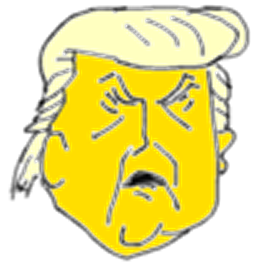

**HELLO BAAAAABY**

Look, having nuclear – my uncle was a great professor and scientist and engineer, Dr. John Trump at M.I.T.; good genes, very good genes, O.K., very smart, the Wharton School of finance, very good, very smart – you know, if you're a conservative Republican, if I were a liberal, if, like, okay, if I ran as a liberal Democrat, they would say I'm one of the smartest people anywhere in the world – it’s true! – but when you're a conservative Republican they try – oh, they do a number – that’s why I always start off: "Went to Wharton, was a good student, went there, went there, did this, built a fortune”– you know I have to give my life credentials all the time, because we're a little disadvantaged – but you look at the nuclear deal, the thing that really bothers me …

-- What does the german expression "HORNOCHSE" mean in english or better american language ?
